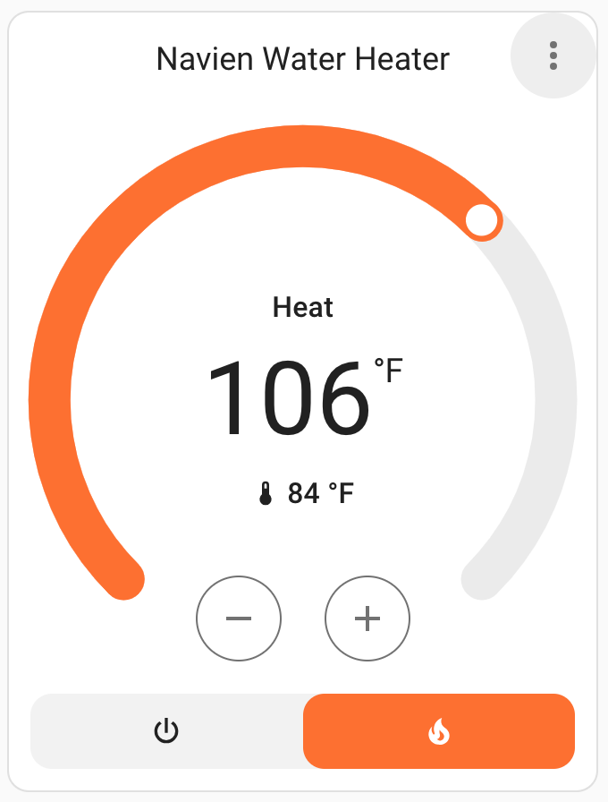
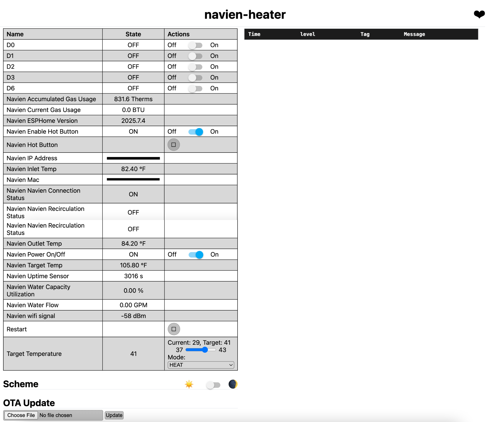

# Navien ESPHome Integration 🚀🔥

Take control of your **Navien gas water heater** directly from Home
Assistant with this ESPHome module!

No more proprietary lock-ins - this project lets you seamlessly
integrate your Navien system into your smart home setup, giving you
automation superpowers like:

-   📱 Remote start/stop from Home Assistant
-   🔔 "Hot Button" entity that can be triggered from automation
-   ⚡ Climate control for setting the target temperature
-   🛠️ Easy to build, flash, and configure with YAML

## Screenshots 🖼️

Here are some examples of how the integration looks in Home Assistant:




This project grew out of my work on reverse engineering the native Navien communication protocol to automate my Navien 240a, which it is tested with thoroughly (and works in my home every day).

👉 GitHub Repo: [htumanyan/navien](https://github.com/htumanyan/navien)

------------------------------------------------------------------------

## Getting Started 🛠️

Follow these steps to build and run your own Navien ESPHome integration.

### 1. Clone the Repository

```
git clone https://github.com/htumanyan/navien.git 
cd navien
```

### 2. Install ESPHome

If you don't already have ESPHome installed:

```
pip install esphome
```

For detailed installation instructions, see the [ESPHome Getting Started
guide](https://esphome.io/guides/getting_started_command_line.html).

### 3. Choose Your Configuration

There are two ready-to-use YAML configurations in this repo:

-   **navien-wrd-hb.yml** → Most people should use this one.
-   **navien-ht-device.yml** → This is for custom esp device that I've designed and plan to open source soon

### 5. Configure Wi-Fi

```
cp secrets.yaml.sample secrets.yaml
```
Edit secrets.yaml - change XXXX to your Wi-Fi network/password and AP SSID network/password in case if it fails to acquire Wi-Fi connection

### 5. Compile and Upload

Compile your firmware:

```
bash esphome compile navien-wrd-hb.yml 
```

Flash it to your ESP32:

```
bash esphome run navien-wrd-hb.yml
```

------------------------------------------------------------------------

## [Protocol Details](./doc/README.md) 🔬

If you're interested in how this integration works under the hood, check
out the [doc](./doc/README.md) subfolder.
It contains the **reverse-engineered details of the Navien
protocol**---including message formats, field definitions, and notes
from packet captures.

This section is for developers and contributors who want to:
- Understand the low-level communication between the ESP32 and Navien
heater
- Contribute improvements to the protocol implementation
- Extend support for additional Navien models or features

If you just want to use the integration, you don't need to worry about
this --- but if you love digging into protocols, that's where the magic
happens.

------------------------------------------------------------------------

## Next Steps 🌟

-   Add your device to **Home Assistant** using ESPHome integration.
-   Create **automations and dashboards** to trigger hot water
    recirculation with a tap, schedule, or voice assistant.
-   Share your setup and feedback with the community!

------------------------------------------------------------------------

💡 This project is community-driven. Contributions, pull requests, and
feature ideas are always welcome!
