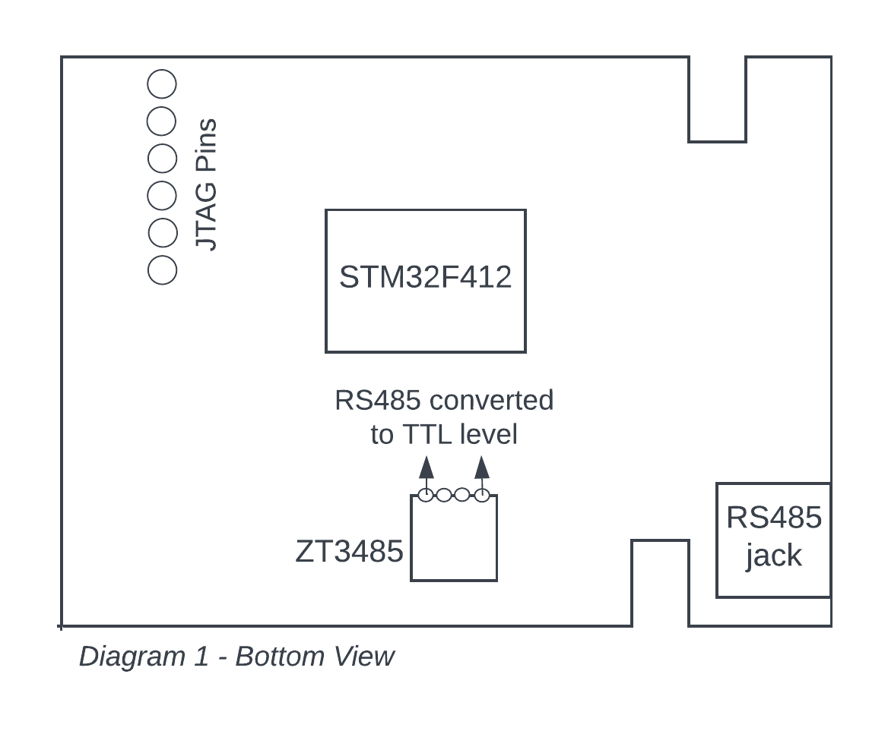
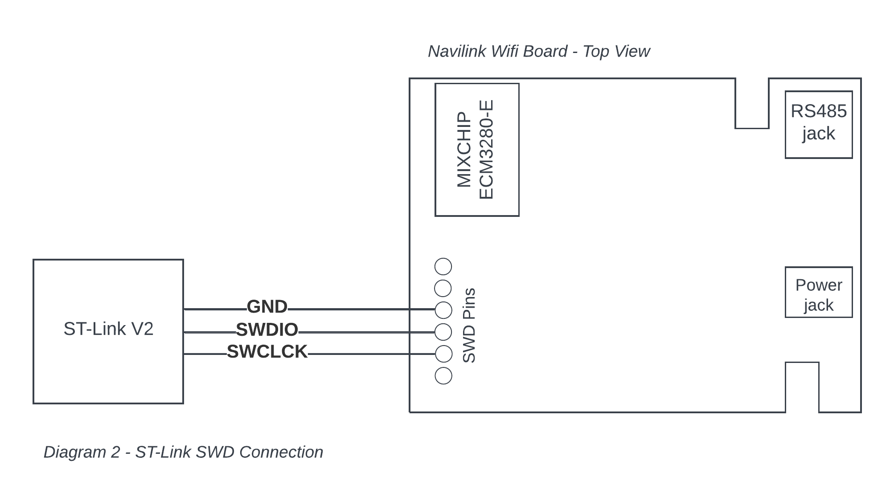

# Navien Wifi Lite

## Hardware
Navien Wifi Lite has two processors onboard: ARM STM32F4 and quite exotic MIXCHIP ECM3280-E wifi module, ironically also ARM based according to the [datasheet](DS0145EN_EMC3280_v2.3.pdf).

STM32F4 is wired to MAX485 RS485 transciever on one side and to connected to the MIXCHIP ECM3280-E wifi module on the other. STM32F4 has all the code and logic of parsing the line level protocol over RS485 connection to Navien decies. MIXCHIP ECM3280-E appears to be taking the Wifi connectivity, registration and also communication with Navien app through AWS cloud.

Notice that the communication to cloud servers is over TLS/SSL, which makes packet capture quite difficult. It is not clear whether client cert validation is implemented or potential MiM interception is possible to substitute keys and extract payloads.

## SWD Interface

Diagram 1 shows the outline of key components as seen from the bottom of the PCB board inside Wifi Lite. The most interesing are the pins in the top left corner, which are wired to the onboard SWD interface of STM32F4, creating the possibility of debugging the firmware onboard.

STM32 devices can be debugged using either JTAG and SWD protocols. I did not find JTAG connectivity/port, but the SWD is present and confirmed to work.

The SWD setup for this board is as follows:

1. Install OpenOCD package
2. Connect ST-Link V2 Emulator Downloader Programmer to SWD pins as shown on the Diagram 2. For my experiments I've used a [cheap programmer from amazon](https://www.amazon.com/gp/product/B07SQV6VLZ) plugged into the USB port of the macbook.

3. Start OpenOCD in the command shell with the following command (replace the path to openocd binary as necessary if it is not in your $PATH)
> openocd -f interface/stlink.cfg -f target/stm32f4x.cfg

4. Plug in the 12V power supply to the NaviLink

